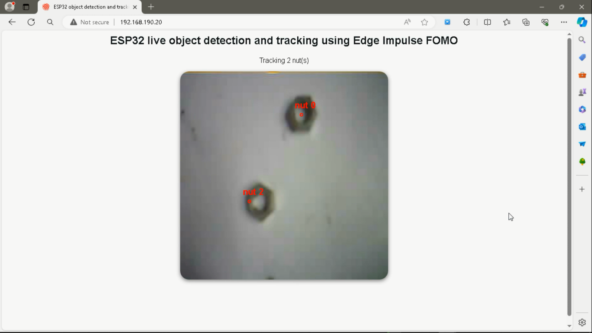

# Object detection with centroid-based tracking: with C++


This repository demonstrates how to implement object detection and tracking the found objects using microcontroller development boards. For demonstration, I implemented this by using an [ESP-EYE development board](https://www.espressif.com/en/products/devkits/esp-eye/overview) and uploaded a custom software which has an [Edge Impulse's FOMO](https://edge-impulse.gitbook.io/docs/edge-impulse-studio/learning-blocks/object-detection/fomo-object-detection-for-constrained-devices) object detection model that detects nuts in an image. When a nut is detected in an image, the software then tracks each nut. 

Edge Impulse FOMO (Faster Objects, More Objects) is a novel machine learning algorithm that brings object detection to highly constrained devices. For example, FOMO did [30 fps (frames per second) object detection on an Arduino Nicla Vision](https://www.youtube.com/watch?v=357_S4iBuhM&feature=youtu.be) (Cortex-M7 MCU), using 245K RAM.

The Arduino sketch [Object_detection_and_tracking_with_FOMO.ino](Object_detection_and_tracking_with_FOMO.ino) is the main file and it performs the following processes:

- Captures an image using the ESP's onboard camera
- Processes the image and passes it to the FOMO object detection model that returns the bounding boxes
- If bounding boxes are found, then they are passed to a [centroid tracker algorithm](centroid_tracker.cpp)
- HTTP web server that shows a live camera feed with the tracked objects

This centroid-based tracking script was adapted from [PyImageSearch's Python object tracking tutorial](https://pyimagesearch.com/2018/07/23/simple-object-tracking-with-opencv/). The resulting image, nut's bounding boxes, and number of tracked nut(s), are then displayed on a web page that is served by the ESP board.


The Machine Learning pipeline ([Impulse](https://edge-impulse.gitbook.io/docs/edge-impulse-studio/impulse-design)), that is the image input processor, feature extractor and neural network, has been exported as an Arduino library. This [Arduino library](https://edge-impulse.gitbook.io/docs/run-inference/arduino-library) is generated by the [Edge Impulse platform](https://edgeimpulse.com/) and it packages all of your signal processing blocks, configuration and learning blocks up into a single package. This also allows us to also include the C++ FOMO model in an Arduino sketch. This Arduino library is included in this repository with the file name [ei-object-detection--nuts Arduino library](ei-object-detection--nuts-arduino-1.0.50.zip). To add, you can also easily clone the public Edge Impulse project, reconfigure it, and deploy a different Arduino library :)

This tutorial has been tested with the [ESP-EYE development board](https://www.espressif.com/en/products/devkits/esp-eye/overview) and it should also work with the ESP32-CAM AI Thinker. Please feel free to test it with other ESP SOCs, modules and DevKits (consider PSRAM availability as it affects the performance).

Please read up on the project's documentation on [hackster.io page](https://www.hackster.io/sologithu/object-detection-with-centroid-based-tracking-c-way-ddaee0) to help you get started on your own creation.

## Quick start :computer:

You can find the public Edge Impulse project here: [Object Detection - nuts](https://studio.edgeimpulse.com/public/391415/latest). Feel free to clone it to your Edge Impulse projects.

Ensure that you have [Arduino IDE](https://www.arduino.cc/en/software) installed on the computer that will be used to upload the code to the ESP board.

___

- Clone the repository using Git. Or download it as a zip file.
```
git clone --branch with-cpp_ESP-demo https://github.com/SolomonGithu/object_detection_and_tracking-centroid_based_algorithm.git
```

- Add the [ei-object-detection--nuts Arduino library](ei-object-detection--nuts-arduino-1.0.50.zip) to the Arduino IDE. On the IDE, you can go to **Sketch > Include Library > Add .ZIP library...**

- If needed, install the **esp32** (by Espressif Systems) board in the IDE using the Boards Manager. In my case, I installed the version 2.0.14 and it worked well.

- If using the ESP-EYE board, select the *M5-Stack-Timer-CAM* board under *Tools*. It should be in the *ESP32 Arduino* list. Use the default settings for the board configuration.

- Open the [Object_detection_and_tracking_with_FOMO.ino](Object_detection_and_tracking_with_FOMO.ino) file and put your Wi-Fi SSID (Wi-Fi network name) and password in the variables *ssid* and *password* respectively. If you are not using the ESP-EYE board, make sure to uncomment the board that you are using among the *CAMERA_MODEL_* variables (and also comment the CAMERA_MODEL_ESP_EYE to prevent conflicts).

- Connect your ESP board to the computer and upload the code.

The ESP board will then connect to the Wi-Fi network and print its IP address on Serial. Finally, use a web browser to open the IP address web page. You will then see a web page and live feed coming from the ESP board. When a nut is detected, its centroids will be shown by a red circle and it will also be tracked and assigned an ID.

Remember that this Machine Learning object detection, object tracking, and serving the HTML web page is done locally on the ESP board. It's so fascinating how low-power, resource constrained and low-cost devices have advanced in the recent years. This has enabled us to deploy lightweight Machine Learning models to these devices with a good performance also.



## Some hacks that were needed :wrench:

The default Edge Impulse ESP Arduino library for object detection models only prints the inference results on Serial. You can however deploy the Impulse as an [Edge Impulse firmware](https://edge-impulse.gitbook.io/docs/run-inference/firmwares) and use the [Edge Impulse CLI](https://edge-impulse.gitbook.io/docs/tools/edge-impulse-cli/cli-installation) to run the firmware with live camera feed. This last alternative will however not allow you to add custom code to the firmware.

In this case, the [Object_detection_and_tracking_with_FOMO.ino](Object_detection_and_tracking_with_FOMO.ino) Arduino code streams the current image captured by the ESP board. This does not change the type of image data, the code only streams the image before it is processed. The image is RGB but for FOMO, we use grayscale images. 

Afterwards, the JavaScript code in the served HTML page (defined in [index_html](utils.cpp)) uses the bounding boxes in JSON data to draw circles around the calculated nut's centroid.

## Tracking different objects :rocket:

Changing the tracked object is very simple and I would highly recommend training and deploying the Machine Learning model using [Edge Impulse](https://edgeimpulse.com/). To do this, please follow the following steps:

- Train a Machine Learning model on Edge Impulse Studio and deploy it as an [Arduino library](https://edge-impulse.gitbook.io/docs/run-inference/arduino-library). This puts your model in a C++ file.
- Add the deployed Arduino library to the IDE.
- In [Object_detection_and_tracking_with_FOMO.ino](Object_detection_and_tracking_with_FOMO.ino), replace ```#include <Object_Detection_-_nuts_inferencing.h>``` with the deployed library name
- In [utils.cpp](utils.cpp), replace ```nut``` in the JavaScript variable ```objects_name``` with the name of the object that you are tracking. This name will be displayed on the web page.
- Currently, if an object is not located in the next 5 subsequent frames (images), the centroid tracker algorithm marks it as disappeared and it is deregistered. If you want to adjust this limitation, update the ```maxDisappeared``` CentroidTracker variable in [centroid_tracker.h](centroid_tracker.h)


