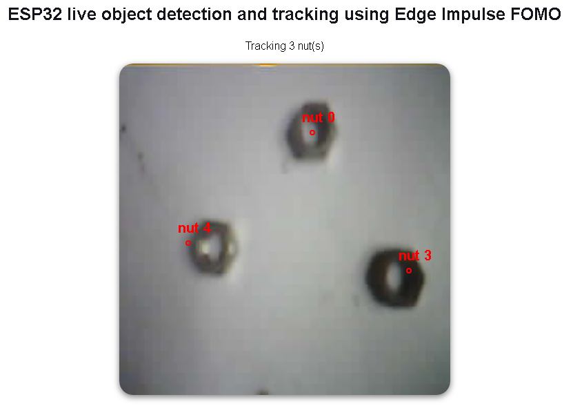

# Object detection with centroid-based tracking



This repository demonstrates how to implement object detection and tracking the found objects. For demonstration, I implemented this by tracking cards. 

[ei_object_detection_and_tracking.py](ei_object_detection_and_tracking.py) uses [OpenCV](https://opencv.org/) to capture camera's images that are then passed to a loaded YOLOv5 model that was trained on [Edge Impulse Studio](https://edgeimpulse.com/). Using [Edge Impulse's Linux Python SDK](https://docs.edgeimpulse.com/docs/edge-impulse-for-linux/linux-python-sdk) the classifier returns the bounding boxes of found cards. These bounding boxes are then passed to [centroid_tracker.py](centroid_tracker.py) that implements a [centroid-based tracking algorithm](https://pyimagesearch.com/2018/07/23/simple-object-tracking-with-opencv/). This centroid-based tracking script was implemented by PyImageSearch. The resulting image, card's bounding boxes, and number of tracked cards is then displayed on a window.


Please read up on the project's documentation on [hackster.io page](https://www.hackster.io/sologithu/object-detection-with-centroid-based-tracking-8b10e0) to help you get started on your own creation.

## Quick start :computer:

You can find the public Edge Impulse project here: [Object detection and tracking](https://studio.edgeimpulse.com/public/250177/latest). Feel free to clone it to your Edge Impulse projects.

Since the object detection script uses Edge Impulse Linux Python SDK, it is important that the scripts are run on a Linux-based computer. If you are on Windows I can confirm that the project runs fine on [WSL](https://learn.microsoft.com/en-us/windows/wsl/install) :thumbsup:. You can use MJPEG Streamer to stream camera images, and XServer to open the OpenCV window. Lastly, run the scripts with Python3! Using Python will result in an error message like the one below:

> **Error message:**   File "ei_object_detection_and_tracking.py", line 71
    print('Result (%d ms.) ' % (res['timing']['dsp'] + res['timing']['classification']), end='')
                                                                                            ^
SyntaxError: invalid syntax

___

Clone the repository using Git
```
git clone https://github.com/SolomonGithu/object_detection_and_tracking-centroid_based_algorithm.git
```

Navigate into the repository
```
cd object_detection_and_tracking-centroid_based_algorithm
```

Install OpenCV for Python:
```
pip3 install opencv-python
```

Install Edge Impulse Linux Python SDK:
```
sudo apt-get install libatlas-base-dev libportaudio0 libportaudio2 libportaudiocpp0 portaudio19-dev
pip3 install edge_impulse_linux -i https://pypi.python.org/simple
```

If you receive an error message ```unable to locate package portaudio``` you can run the command below, followed by the pip3 command to install edge_impulse_linux:
```
sudo apt get install python-pyaudio
```

Install the scipy package that is required by [centroid_tracker.py](centroid_tracker.py):
```
pip3 install scipy
```

Start the project by running the command:
```
python3 ei_object_detection_and_tracking.py
``` 

- If you get the error message below, then you will need to identify your camera id and change the value of  ```camera_id``` in [ei_object_detection_and_tracking.py](ei_object_detection_and_tracking.py)

```
[ WARN:0] global /io/opencv/modules/videoio/src/cap_v4l.cpp (802) open VIDEOIO ERROR: V4L: can't open camera by index 0
```

## Tracking different objects :rocket:

Changing the tracked object is very simple and I would highly recommend training and deploying the Machine Learning model using [Edge Impulse](https://edgeimpulse.com/). To do this, please follow the following steps:

- Train a Machine Learning model on Edge Impulse Studio and deploy it for Linux targets (this will be a .eim executable)
- Copy the downloaded .eim to the [modelfile](modelfile) folder
- Update the ```modelfile``` path in [ei_object_detection_and_tracking.py](ei_object_detection_and_tracking.py) to match the name of your downloaded .eim file
- Update the targeted class name which should be the same class name used in your Edge Impulse project. This target class is defined at ```if(bb['label'] == 'card')``` . In this case ```card``` is the target class.


